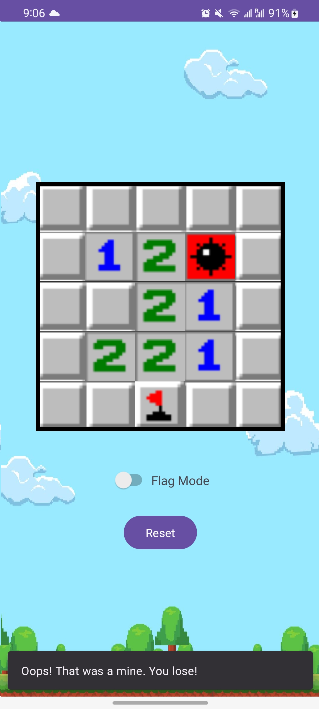

# MINI-MINE
a minesweeper implementation

---

  - If you click on a field in the Flag mode then:    
        o If you flagged a field but there is no mine, the game ends.      
        o If you flagged a field and there are no more mines, the game end and the player wins!   
  - If not in the Flag mode then:    
        o If you hit a mine, the game ends.      
        o If you did not hit a mine, a number appears on that field indicating how many mines are nearby.     

The recursive property of exposing all safe connected cells when a safe cell is tried is implemented.

